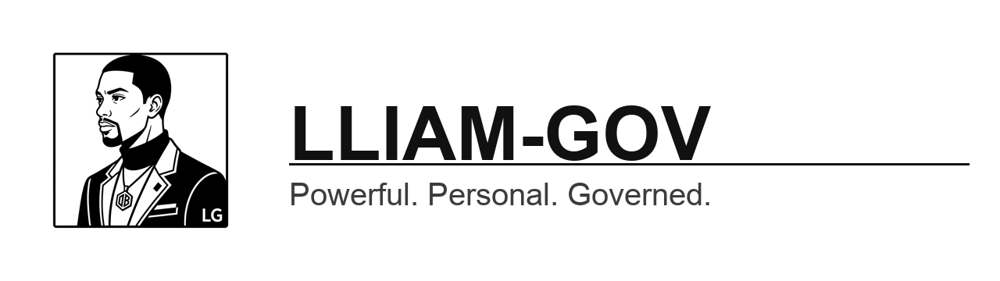

<p align="center">
  
</p>

<p align="center"><strong>Powerful. Personal. Governed.</strong></p>

<p align="center">
  <a href="LICENSE"></a>
  
  
  
  
  
</p>

---

## What is Lliam-GOV?

**Lliam-GOV is a personal AI agent with enterprise-grade governance built into its core.** It runs on your own machine, talks to the model providers you already pay for through their local CLIs, and does real work for you — while producing the kind of evidence trail, access controls, and security posture normally reserved for regulated enterprise software.

Most personal AI agents ask you to trust them. Lliam-GOV is designed to **prove** it behaved: every action it takes is recorded in an append-only, hash-chained audit log; its data is encrypted at rest; its network egress is restricted to an explicit allow-list; and any attempt to expand its own capabilities or modify itself passes through a human-approval gate. It is aligned to **ISO/IEC 42001** (AI management systems) and hardened toward **CMMC Level 2 / ISO 27001** controls, so the same agent that drafts your email can stand as audit evidence in a formal AI governance program.

That governance layer is the point. It is what makes this **Lliam-GOV** and not just another agent runtime.

> **Why "GOV"?** Governance — not government-only. Lliam-GOV is built for anyone who wants a powerful personal agent that is accountable by design: professionals handling sensitive data, regulated teams, and individuals who simply want their AI to keep receipts.

---

## Why it matters

| Most AI agents | Lliam-GOV |
|---|---|
| Trust-me security | **Provable** security — append-only, hash-chained audit log |
| Data in the clear | **Encryption at rest** for the agent workspace |
| Open network access | **Egress allow-list**, deny-all by default, TLS enforced |
| Self-modifies silently | **Human-approval gate** on capability + self-modification |
| API-key lock-in | **Multi-provider local CLI** — bring the model you already use |
| No paper trail | **ISO/IEC 42001-aligned** evidence, ready for audit |

---

## Features

- **Governance-first core** — encryption at rest, append-only hash-chained audit logging, egress allow-list with TLS enforcement, capability gates, and a human-approval gate over dynamic self-modification.
- **Multi-provider, local-CLI inference** — choose your model through the provider CLI you already use: **Claude Code CLI** (Anthropic), **Codex CLI** (OpenAI), and **Gemini / Antigravity CLI** (Google). No API-key gating, no vendor lock-in.
- **Desktop app + terminal** — a packaged cross-platform desktop application plus a full terminal interface with streaming tool output.
- **CUI-aware handling** — controlled-information marking and audit instrumentation for sensitive workflows.
- **Skills & automation** — an extensible skill system and a built-in scheduler for unattended, recurring work.
- **Runs where you do** — designed for your own machine first; messaging surface deliberately narrowed to vetted channels.
- **Supply-chain hygiene** — SBOMs, dependency review, and signed/checksummed release artifacts on the roadmap to stable.

---

## Quickstart

> **Status:** packaging, signing, and public releases are in progress. Until signed installers ship, the proven path is a governed clone-and-run on macOS.

### Option A — Governed install (macOS, demo/eval)

```bash
# one-time on a fresh Mac: install + auth GitHub CLI (the repo is private)
brew install gh && gh auth login

# clone and provision the governed profile
gh repo clone jdavis-cyber/lliam-gov && cd lliam-gov
bash scripts/install-governed-macbook.sh
```

This provisions a private `~/.lliam-gov` workspace (`0700`), enables encryption-at-rest, the egress allow-list (deny-all default), and the capability + self-modification gates, writes a double-clickable launcher, and runs a fail-closed posture check. Then connect a model through your provider CLI:

```bash
source ~/.lliam-gov/governed-demo.env
uv run lliam-gov setup     # detects Claude Code / Codex / Gemini CLIs and guides provider login
```

> **Demo/eval only.** The eval profile waives the FIPS hard-gate because **no CUI is in scope**. Do **not** use the eval profile on a managed or CUI-in-scope device — that is a separate, controlled production decision. See [`docs/operate/`](docs/operate/) for the production profile.

### Option B — Signed desktop installers

_Coming soon — signed macOS `.dmg`, Windows `.msi`, and Linux `AppImage` artifacts are tracked in the deployment milestone and will be linked here once published._

---

## Architecture

Lliam-GOV is a desktop application shell over a managed local backend that brokers inference to external provider CLIs:

```
┌─────────────────────────────────────────────┐
│  Lliam-GOV Desktop App (Electron)            │
│  • first-run provider setup & model picker   │
│  • update / rollback / release channels      │
└───────────────┬─────────────────────────────┘
                │ local IPC
┌───────────────▼─────────────────────────────┐
│  Managed Backend (location-independent)      │
│  • governance core: audit log, encryption,   │
│    egress allow-list, capability gates       │
│  • provider adapters + health checks         │
└───────────────┬─────────────────────────────┘
                │ subprocess (allow-listed, sandboxed)
┌───────────────▼─────────────────────────────┐
│  Provider CLIs (you authenticate these)      │
│  Claude Code · Codex · Gemini / Antigravity  │
└─────────────────────────────────────────────┘
```

The agent runtime, conversation loop, terminal UI, plugin framework, and skill system are upstream Hermes work (see attribution). Lliam-GOV adds the governance core, the CLI-provider runtime contract, the desktop deploy layer, and the compliance evidence set.

---

## Security & Compliance

Governance is the headline feature, not an afterthought. Lliam-GOV implements:

- **Encryption at rest** for the agent workspace (FIPS-validated path available for production).
- **Append-only, hash-chained audit log** — tamper-evident record of agent actions.
- **Egress allow-list** — deny-all by default, TLS enforced; the agent can only reach explicitly approved destinations.
- **Capability & self-modification gates** — dynamic capability expansion and agent self-modification require human approval.
- **Narrowed messaging surface** — integration channels deliberately restricted to a vetted set.
- **CUI marking & audit instrumentation** — controlled-information handling for sensitive workflows.
- **Supply-chain hygiene** — dependency review, SBOMs (CycloneDX), and signed/checksummed artifacts (in progress to stable).
- **ISO/IEC 42001 alignment** — the agent is instrumented to serve as evidence inside a formal AI Management System, with hardening toward CMMC L2 / ISO 27001 controls.

Security disclosures: see [`SECURITY.md`](SECURITY.md). Release evidence (threat model, architecture, data-flow/provider boundaries, SBOMs, QA matrix) is maintained under [`evidence/`](evidence/).

---

## Built on Hermes Agent

Lliam-GOV is a governance-hardened fork of **[Hermes Agent](https://github.com/NousResearch/hermes-agent)** by **[Nous Research](https://nousresearch.com)**, used under the **MIT License**.

The upstream agent runtime, conversation loop, provider adapters, terminal backends, plugin framework, skill system, dashboard UI, and gateway scaffolding are Hermes work. Lliam-GOV's contribution is the documented governance overlay, the multi-provider local-CLI runtime, the desktop deployment layer, and the ISO 42001 evidence set described above. **No original authorship of the upstream Hermes codebase is claimed.**

Full attribution and scope are in [`NOTICE`](NOTICE); the upstream MIT license is preserved in [`LICENSE`](LICENSE). With gratitude to the Nous Research team and the Hermes community.

---

## Contributing

Contributions are welcome. Please read [`CONTRIBUTING.md`](CONTRIBUTING.md) for development setup, code style, and the PR process, and open an issue before large changes. Security-sensitive reports should follow [`SECURITY.md`](SECURITY.md) rather than a public issue.

---

## License

Lliam-GOV is released under the **MIT License** — see [`LICENSE`](LICENSE).

Upstream © Nous Research (Hermes Agent, MIT). Lliam-GOV governance overlay and deployment layer © Jerome Davis. See [`NOTICE`](NOTICE) for the full attribution.
